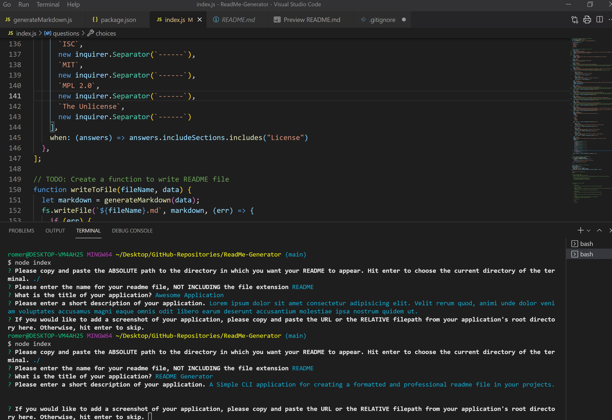

# README Generator [")](https://opensource.org/licenses/MIT)
  
  ## Description
  A simple CLI interface application that streamlines the process of creating a README file for your projects, saving time and energy for coding.

  This project was created as a way to generate consistent, high-quality README files in an intuitive way - and yes, this readme was written by using the app itself. 
  
  Technologies used include:

  * Node.js
  * Node Inquirer

  Developing this project was an excellent exercise in utilizing, troubleshooting, and executing JavaScript files within the Node.js runtime. Learning the Inquirer module opened my eyes to the possibilities of CLI interface applications and what they could achieve. I plan to formalize this application as a node module and install it globally on my machine for personal use.

  Take a look at the resources below for more best practices when using README Generator:

  * [Professional README Guide](https://coding-boot-camp.github.io/full-stack/github/professional-readme-guide) 
  * [Markdown Syntax CheatSheet](https://www.markdownguide.org/cheat-sheet/)
  
  

  ---
  ## Table of Contents
1. [Installation](#installation)
1. [Usage](#usage)
1. [Contribution](#contribution)
1. [Testing](#testing)
1. [License](#license)
1. [Questions](#questions)

  ---
  
  ## Installation
    
To install this application, follow the steps below. 

1. Download project files to your local machine in a place where you can find them.
1. If you have not already done so, install [Node.js](https://nodejs.org/en/ "Download and Install Node.js").
1. Navigate to project directory and run the following command to install required dependencies:
	
```bash
npm install
```

4. You should now be able to initialize the application by running the following command from the terminal within the project directory:

```bash
node index.js
```

---

## Usage
    
This application is useful for quickly generating complete and professional readme files. It utilizes a Command Line Interface (CLI) and a series of prompts based on the Inquirer Node.js module to achieve this. 

README Generator is initalized by navigating to the project directory in the terminal and running the following command:

```bash
node index.js
```

**_Please be advised that if the README filename entered is already in use by a pre-existing file in the targeted directory, THE APPLICATION WILL OVERWRITE THAT FILE._** 

Please note that the prompt sequence and README write can be aborted in the terminal at any time by pressing `ctrl + c`.

## Text Editor Prompts

Some of the prompts with the potential for longer entries will open the default text editor to allow the user to edit and write longer entries in a more user-friendly fashion. These sections are marked in this readme next to the header with `(Text Editor Prompt)`. 

To open the response file with the text editor, the CLI will prompt the user to hit enter. Please note that the text editor may only open in the background and may need to be brought up via the task bar. The text input will follow markdown syntax so feel free to customize sections as desired. A general guide to markdown syntax can be found [here](https://www.markdownguide.org/cheat-sheet/). 

A header for the section is not required in the response as these are automatically generated. Once finished writing the section content, you need only save the file and exit the text editor to record the response and proceed to the next prompt in the terminal.

## Required Prompts

The following sections can not be omitted by the user either because they are required for constructing the file or because they are commonly viewed as a Minimum Viable Product (MVP) for an effective README file:

* **Absolute Filepath** to write the README file to (the default is the current directory indicated by "./")
* **README Filename** (the default and best practice is to use README but this prompt is included in case a different naming convention is desired)
* **Title of Application** (to be displayed at the top of the readme file)
* **Description** (first section to be displayed, above the image if included)

**_Description_** `(Text Editor Prompt)`

This section is included so that a user may enumerate their motivations, intentions, challenges, and future direction of their projects. It can be thought of as the introduction to the README and synopsis of the project's purpose.

## Optional Prompts

For greater user interoperability and to allow for preferred styles of README, the following sections are optional and may be included or omitted at the users discretion:

* Screenshot Image
* Installation
* Usage
* Contribution
* Testing
* License
* Questions 

A prompt will ask which sections to include and a user may customize to their preference. Sections that are unselected in this prompt will not appear in the markdown and will be skipped in the prompt sequence.


**_Screenshot Image_** `(Direct CLI Input Prompt)`

Most professional README files will include a screenshot or gif of their project as a visual reference to the functionality of their application. This CLI does include the option to include a single image or gif in the markdown directly from the CLI if desired, but this option can be skipped if the user would prefer to omit an image or to add one manually to the markdown later. If the user DOES wish to include an image via the CLI, they will be prompted for the following:

* URL or RELATIVE filepath of the image (best practice to copy/ paste to avoid typos).
* Alternative Text to display if there is an issue with displaying the image or for screenreaders.
* "Tool Tip" text that will appear when the image is hovered over by the cursor.

This information will be used to generate markdown syntax to display the image just below the "Description" section, and above the "Table of Contents" section.

**_Installation_** `(Text Editor Prompt)`


This section is included so that the user may enter instructions for installing their application. It can include lists of dependencies, step by step install instructions, best practices, optional configurations, and the like.

**_Usage_** `(Text Editor Prompt)`

This section is included so that the user may include documentation and instructions for using their application. It may be used for enumerating functionalities, listing commands and options, and how to achieve success in use of the application.

**_Contribution_** `(Text Editor Prompt)`

This section is included so that the user may include guidelines for open source or collaborative efforts to further develop features and functionality of their project. It can define a standardized process of contribution (such as pull request protocol), syntax guidelines, variable naming conventions, and so forth.

**_Testing_** `(Text Editor Prompt)`

This section is included to define the tests that a user has performed on a project, list known bugs, and how other users may report issues.

**_License_** `(Select From List Prompt)`

This section is included to clearly state the usage license that the project is covered by. It auto generates the license shield badge next to the Title, as well as the full license explanation section. 

The user will be prompted to select from a list of licenses. If the blank option is selected, the section will be omitted regardless of if it was selected as included in the "Include Sections" prompt. 

**_Questions_** `(Text Editor Prompt)`

This section is included to allow other users and collaborators to reach you should further questions or support be needed. It will prompt for: 
* A synopsis of your contact _situation_, (such as work obligations, availability schedule, hours of operation, etc. The default response may be selected if you wish to avoid divulging this information.)  
* Select from a list of pre-formatted contact methods. 

As of README Generator v1.0.0, prompts for your GitHub, Email, and Twitter accounts are included. More mediums of contact will be added in subsequent versions. In the meantime, additional mediums may be manually added. 


---

## Contribution
    
Thank you for considering contributing to this project. If you would like to contribute, feel free to fork the repository, add your functionality or bugfix, and submit a pull request. I will review the changes and contact you with any questions or concerns. 

Please refer to the code for consistent and descriptive variable naming and utilize proper indentation and syntax for readability.

Please see the "Questions" section if you would like to reach me directly to discuss possible directions for the project or ideas for improvement.

---

## Testing
    
I have yet to create a test suite for this project as of v1.0.0. My preference is Jest for purposes of TDD. If you would like to submit a test suite, please refer to the contribution guidelines in the [Contribution](#contribution) section or reach out to me via any of the methods listed in the "Questions" section.

As of v1.0.0, my testing has consisted of console.log() and checking outputs by running the program locally. All functionality appears to be in order as of v1.0.0 but if bugs do arise please do not hesitate to let me know about them! I intend to utilize TDD for further progress on this project via the Jest test suite.

---

## License
  
  This application is licensed under **The Massachusets Institute of Technology License (MIT)**.
  
  Click the license badge below for more information and usage guidelines:
  
  [")](https://opensource.org/licenses/MIT)
  
  Click [here](https://www.mit.edu/~amini/LICENSE.md
  "MIT Full Terms and Conditions") to view the full terms and conditions text of MIT.
  
  ---
  
  ## Questions
  
If you would like to discuss the project or have questions about functionality/ bug reports, please do not hesitate to reach out with any questions you may have. I am currently in the Northwestern University Coding bootcamp and as such my time is somewhat limited for responding to questions but I will make an effort to respond in a timely fashion. I can be reached in the following ways:

* Email: [Romere88@gmail.com](mailto:Romere88@gmail.com "Click to send me an Email!")
* GitHub: [ElijahRomer](http://www.github.com/ElijahRomer "Click to visit my GitHub page!")


Thank you for reaching out and I look forward to getting in touch with you soon!


